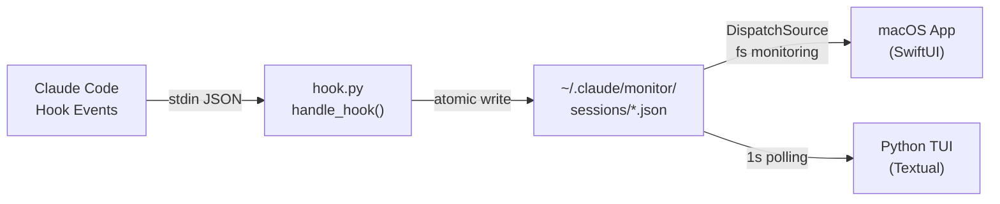
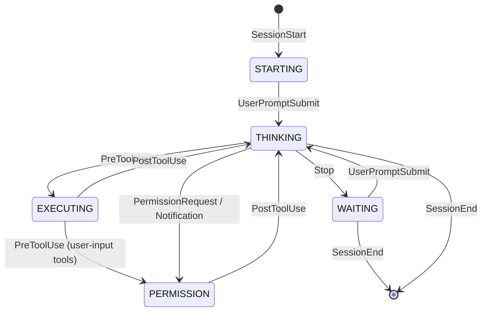

# Claude Monitor

Real-time monitoring of active Claude Code sessions, with dual interface: **TUI** (terminal) and **native macOS app** with menu bar.

## Overview

When working with multiple Claude Code sessions in parallel, it's easy to lose track of which session is waiting for input, which requires permissions, and which is still processing. Claude Monitor solves this by intercepting Claude Code lifecycle events through the hook system and presenting every session's state in a single dashboard.

Both interfaces share the same filesystem state and can run simultaneously:

- **Python TUI** — terminal interface built on [Textual](https://textual.textualize.io), lightweight and portable
- **macOS App** — native SwiftUI application with main window, menu bar icon, Dock badge, and attention notifications

## Architecture



### Architectural patterns

| Pattern | Detail |
|---|---|
| **Event-driven** | 10 Claude Code hook events mapped to state transitions |
| **File-based IPC** | JSON files in `~/.claude/monitor/sessions/` as single source of truth |
| **Atomic writes** | Temp file + `os.replace()` to prevent partial reads |
| **Directory monitoring** | `DispatchSource` (macOS) / 1s polling (Python) |
| **Zombie cleanup** | Automatic removal of stale sessions with per-status thresholds |

## Project structure

```
claude-monitor/
├── pyproject.toml                          # Python packaging (hatchling)
├── src/claude_monitor/
│   ├── main.py                             # CLI: install/uninstall hooks, launch TUI
│   ├── hook.py                             # Hook event handling, state mapping
│   ├── state.py                            # SessionState, JSON read/write
│   └── tui.py                              # Textual TUI with DataTable
│
└── ClaudeMonitor/
    ├── Package.swift                       # Swift Package Manager
    └── ClaudeMonitor/
        ├── ClaudeMonitorApp.swift           # Entry point, WindowGroup + MenuBarExtra
        ├── AppDelegate.swift                # Badge reset on focus
        ├── Models/
        │   ├── Session.swift                # Codable data model
        │   └── SessionStatus.swift          # Status enum with colors and SF icons
        ├── Views/
        │   ├── SessionTableView.swift       # Main table + status bar
        │   └── MenuBarView.swift            # Menu bar dropdown
        └── Services/
            ├── SessionStore.swift           # @Observable store, transitions, badge
            └── DirectoryMonitor.swift       # DispatchSource filesystem monitor
```

## Session state machine

Each session transitions through these states, mapped to Claude Code hook events:



| Hook Event | Resulting State | Notes |
|---|---|---|
| `SessionStart` | `STARTING` | Session init, model extraction |
| `UserPromptSubmit` | `THINKING` | Saves the prompt; the first one becomes the topic |
| `PreToolUse` | `EXECUTING` | Records the tool name being used |
| `PreToolUse` | `PERMISSION` | Override for user-input tools (`ExitPlanMode`, `AskUserQuestion`) that prompt the user for approval without triggering `PermissionRequest` |
| `PermissionRequest` | `PERMISSION` | Waiting for user confirmation |
| `PostToolUse` | `THINKING` | Increments the tool counter |
| `Stop` | `WAITING` | Session waiting for next prompt |
| `SessionEnd` | *(removed)* | State file is deleted |
| `Notification` | `PERMISSION`* | Only when `notification_type == "permission_prompt"` |
| `SubagentStart` | — | Adds subagent to the session's list |
| `SubagentStop` | — | Removes subagent from the session's list |

### Zombie thresholds (macOS app)

| Status | Threshold | Rationale |
|---|---|---|
| `WAITING` | 4 hours | User may still be reading the output |
| `THINKING` / `EXECUTING` / `PERMISSION` / `STARTING` | 15 minutes | Process almost certainly dead |
| `ENDED` | 24 hours | Explicit termination by Claude |

The Python TUI uses a single 24-hour threshold with manual cleanup (`c`).

## Session data format

Each session is saved to `~/.claude/monitor/sessions/{session_id}.json`:

```json
{
  "session_id": "abc-123",
  "cwd": "/path/to/project",
  "project": "my-project",
  "status": "THINKING",
  "tool_name": null,
  "permission_mode": "default",
  "model": "claude-opus-4-6",
  "topic": "Implement feature X",
  "last_prompt": "...",
  "tool_count": 12,
  "started_at": "2025-01-15T10:30:00+00:00",
  "last_updated": "2025-01-15T10:35:22+00:00",
  "subagents": [
    {
      "agent_id": "sub-456",
      "agent_type": "Explore",
      "status": "running",
      "last_updated": "2025-01-15T10:34:00+00:00"
    }
  ]
}
```

## Notifications (macOS app)

| Transition | Action |
|---|---|
| Enter `PERMISSION` | Dock bounce (critical attention request) |
| Exit `PERMISSION` | Cancel bounce |
| Enter `WAITING` | Increment Dock badge |
| Exit `WAITING` | Decrement Dock badge |
| App gains focus | Reset badge to zero |

## Requirements

### Python TUI

- Python >= 3.10
- `textual >= 3.0`
- `click >= 8.0`

### macOS App

- macOS 15+ (Sequoia)
- Swift 6.0+
- Xcode (for building)

## Installation and usage

### Python TUI

```bash
# Install the package
pip install -e .

# Register hooks in ~/.claude/settings.json
claude-monitor install

# Launch the monitor
claude-monitor

# Remove hooks
claude-monitor uninstall
```

**TUI shortcuts:** `q` quit, `r` refresh, `c` clean up old sessions (> 1 hour)

### macOS App

```bash
cd ClaudeMonitor
./run.sh
```

The app launches with a main window and a menu bar icon. It reads automatically from `~/.claude/monitor/sessions/` — requires the Python hooks to be installed.
